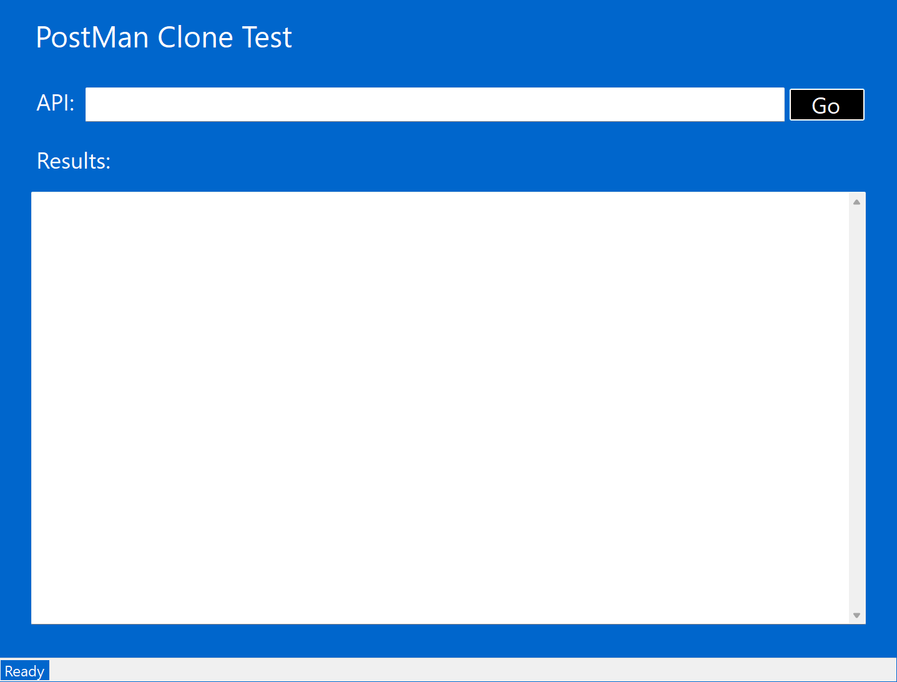
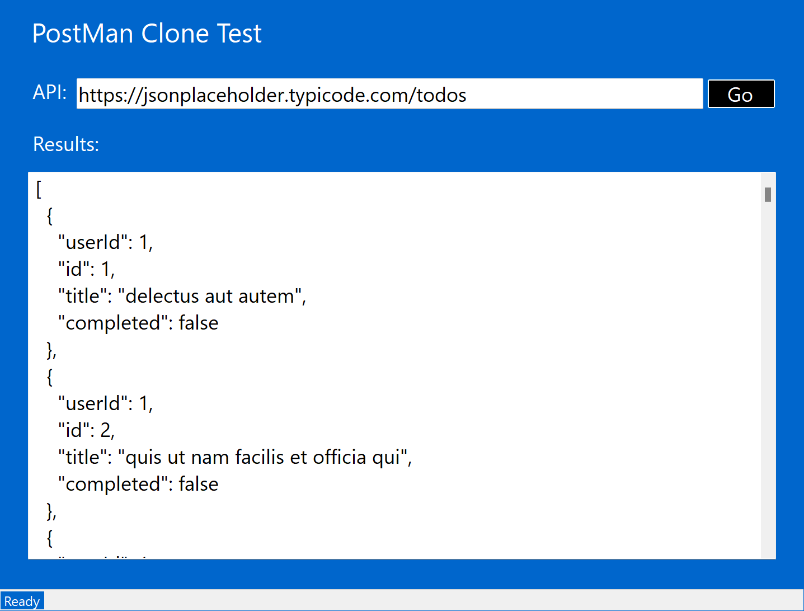

# PostMan Clone

This Postman Clone provides a user-friendly interface for making GET requests to APIs and viewing the responses in formatted JSON.

## Technologies Used

* C#
* .Net 8
* WinForms
* HttpClient

## Using The App

1. Download the executable file from the release section.
2. When the application launches it should like this:

3. Feel free to use any GET requests as shown here:

4. To Close the the application press the "ESC"-Key on the active window.

## Upcoming Changes
* Adding more REST-functionality
* Adding API Headers
* Adding Logging
* Adding Depedency Injection
* Handling API authentification and authorization
* More surprises
